# Проектный практикум курса "Инженерия машинного обучения"

## 1. Постановка задачи

### Тема: Прогнозирование продолжительности поездки на такси в Нью-Йорке
Проект направлен на создание модели машинного обучения, способной прогнозировать общую продолжительность поездки 
на такси в Нью-Йорке, используя различные характеристики маршрута. Полученная модель поможет автоматизировать процесс 
оценки стоимости поездки, учитывая различные факторы, такие как место отправления и прибытия, время суток, 
погодные условия и прочее.

---

### Описание Данных

Данные состоят из следующих признаков, которые условно разделены на несколько групп:

#### Данные о клиенте и таксопарке:
- **id** - уникальный идентификатор поездки.
- **vendor_id** - уникальный идентификатор поставщика услуг (таксопарка).

#### Временные характеристики:
- **pickup_datetime** - дата и время, когда был включён счётчик поездки.
- **dropoff_datetime** - дата и время, когда счётчик был отключён.

#### Географическая информация:
- **pickup_longitude** - долгота, на которой был включён счётчик.
- **pickup_latitude** - широта, на которой был включён счётчик.
- **dropoff_longitude** - долгота, на которой счётчик был отключён.
- **dropoff_latitude** - широта, на которой счётчик был отключён.

#### Прочие признаки:
- **passenger_count** - количество пассажиров в транспортном средстве (введённое водителем значение).
- **store_and_fwd_flag** - флаг, который указывает, сохранилась ли запись о поездке в памяти транспортного средства перед отправкой поставщику (Y — хранить и пересылать, N — не хранить и не пересылать поездку).

#### Целевой признак:
- **trip_duration** - продолжительность поездки в секундах.

---

## 2. Знакомство с данными, базовый анализ и расширение данных


### Задание 2.1 

**Постановка задания:** Переведите признак pickup_datetime в тип данных datetime и определите временные рамки представленных данных.

**Ответ:** 
- Дата начала:  2016-01-01
- Дата конца:  2016-06-30

---

### Задание 2.2 

**Постановка задания:** Посчитайте количество пропущенных значений в данных.

**Ответ:** 
- Количество пропущенных значений:  0.

---

### Задание 2.3 

**Постановка задания:** Изучите статистические характеристики некоторых признаков.

**Ответ:** 
- Количество уникальных таксопарков:  2
- Максимальное количество пассажиров:  9
- Средняя длительность поездки (в секундах):  959
- Медианная длительность поездки (в секундах):  662
- Минальное время поездки (в секундах):  1
- Максимальное время поездки (в секундах):  3526282
- В данных присутствуют поездки, продолжительностью более 40 дней и продолжительностью 1 секунда (вероятно это выбросы).

---

### Задание 2.4 

**Постановка задания:** Добавьте новые признаки, связанные с датой и временем поездки.

**Ответ:** 
- Количество поездок в субботу: 220868
- Среднее количество поездок в день: 8015

---

### Задание 2.5 

**Постановка задания:** Добавьте признак, указывающий на то, была ли поездка начата в праздничный день.

**Ответ:** 
- Медианное значение длительности поездок в праздничные дни (в секундах): 585

---

### Задание 2.6 

**Постановка задания:** Используйте данные из Open Source Routing Machine (OSRM) для добавления новых признаков.

**Ответ:** 
- Разница между медианной длительностью поездки в данных и OSRM (в секундах): 372.5
- Количество пропусков в столбце с OSRM: 1

---

### Задание 2.7 

**Постановка задания:** Добавьте географические признаки.

**Ответ:** 
- Медианное расстояние Хаверсина поездок (в киллометрах): 2.09

---

### Задание 2.8

**Постановка задания:** Реализовать функцию `add_cluster_features()`, которая принимает на вход таблицу с данными о 
поездках и обученный алгоритм кластеризации. Функция должна возвращать обновленную таблицу с добавленным в неё столбцом 
`geo_cluster` - географический кластер, к которому относится поездка.


**Ответ:** 

```python
def add_cluster_features(taxi_data, kmeans):
    taxi_data['geo_cluster'] = kmeans.predict(
        taxi_data[['pickup_latitude', 'pickup_longitude',
                   'dropoff_latitude', 'dropoff_longitude']])
    return taxi_data
```

**Вопрос:** Сколько поездок содержится в наименьшем по размеру географическом кластере?

**Ответ:** 
В наименьшем по размеру географическом кластере содержится: 1.53 поездки.

---

### Задание 2.9

**Постановка задания:** Реализовать функцию `add_weather_features()`, которая принимает на вход две таблицы: таблицу с данными о поездках и таблицу с данными о погодных условиях на каждый час. Функция должна возвращать обновленную таблицу с данными о поездках с добавленными в неё 5 столбцами: `temperature`, `visibility`, `wind speed`, `precip`, и `events`.

```python
def add_weather_features(taxi_data, weather_data):
    weather_data['time'] = pd.to_datetime(weather_data['time'],
                                          format='%Y-%m-%d %H:%M:%S')
    
    weather_data['date'] = weather_data['time'].dt.date
    weather_data['hour'] = weather_data['time'].dt.hour
    weather_data = weather_data[['temperature', 'visibility', 'wind speed',
                                 'precip', 'events', 'date', 'hour']]
    
    taxi_data = taxi_data.merge(weather_data,
        left_on=['pickup_date', 'pickup_hour'],
        right_on=['date', 'hour'], how='left')

    taxi_data = taxi_data.drop(['date', 'hour'], axis=1)
    
    return taxi_data
```

**Вопросы:**
- а) Сколько поездок было совершено в снежную погоду?
- б) Сколько процентов от общего количества наблюдений в таблице с данными о поездках занимают пропуски в столбцах с погодными условиями? Ответ приведите с точностью до сотых процента.

**Ответы:** 

- а) Количество поездок в снежную погоду: 13126.
- б) Процент пропусков в столбцах с погодными условиями: temperature 0.82%, visibility 0.82%, wind speed 0.82%, precip 0.82%, events 0.82%.

---

### Задание 2.10

**Постановка задания:** Реализовать функцию `fill_null_weather_data()`, которая принимает на вход таблицу с данными о поездках. Функция должна заполнять пропущенные значения в столбцах.

Пропуски в столбцах с погодными условиями (`temperature`, `visibility`, `wind speed`, `precip`) заполняются медианным значением температуры, влажности, скорости ветра и видимости в зависимости от даты начала поездки. Для этого данные сгруппированы по столбцу `pickup_date` и рассчитывается медиана в каждой группе, после чего с помощью комбинации методов `transform()` и `fillna()` заполняются пропуски. Пропуски в столбце `events` заполняются строкой `'None'` - символом отсутствия погодных явлений (снега/дождя/тумана).

Пропуски в столбцах с информацией из OSRM API (`total_distance`, `total_travel_time` и `number_of_steps`) заполняются медианным значением по столбцам.


```python
def fill_null_weather_data(taxi_data):
    weather_columns = ['temperature', 'visibility', 'wind speed', 'precip']
    
    for col in weather_columns:
        taxi_data[col] = taxi_data[col].fillna(
            taxi_data.groupby('pickup_date')[col].transform('median'))

    taxi_data['events'] = taxi_data['events'].fillna('None')
    osrm_columns = ['total_distance', 'total_travel_time', 'number_of_steps']
    taxi_data[osrm_columns] = taxi_data[osrm_columns].fillna(
        taxi_data[osrm_columns].median())
    return taxi_data
```

**Вопрос:** Чему равна медиана в столбце `temperature` после заполнения пропусков? Ответ округлите до десятых.

**Ответ:** Медиана в столбце `temperature` после заполнения пропусков равна 11.1.

---

### Задание 2.11

**Цель задания:** Найти и удалить выбросы из набора данных по следующим критериям:

**Вопросы:**
1. Сколько выбросов по признаку длительности поездки удалось найти?
2. Сколько выбросов по признаку скорости удалось найти?

**Ответы:**
а) Выбросов по признаку длительности поездки: 4
б) Выбросов по признаку скорости: 407

---

# 3. Разведывательный анализ данных (EDA)

### Задание 3.1

**Цель задания:** Исследовать распределение длительности поездок в логарифмическом масштабе и проверить его на нормальность с помощью теста Д’Агостино.

**Решение:** 

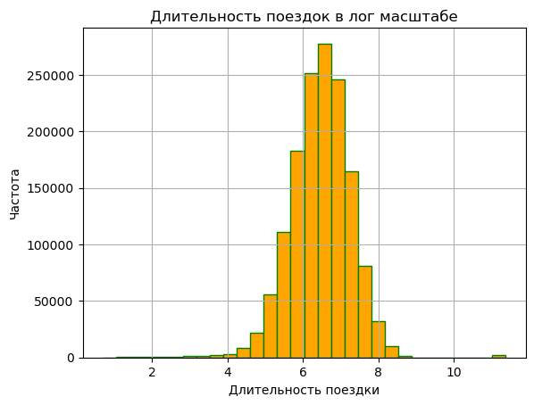
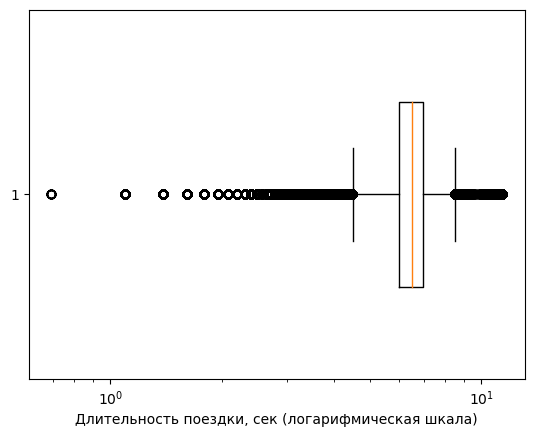

По распределению можно наблюдать выбросы. P-value (тест Д’Агостино) равен: 0.00. Распределение не является нормальным.

---

### Задание 3.2

**Цель задания:** Сравнить распределение длительности поездок в логарифмическом масштабе в зависимости от таксопарка.

**Решение:** 

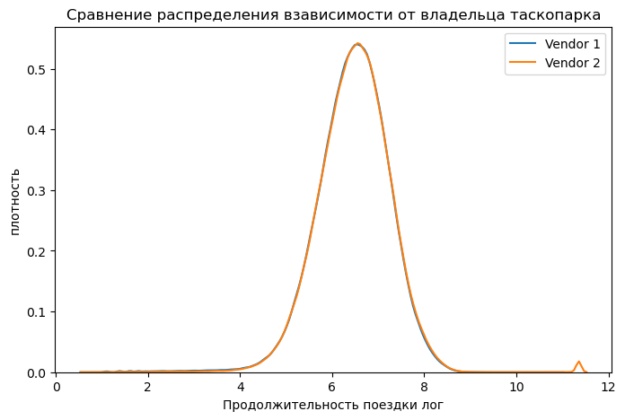
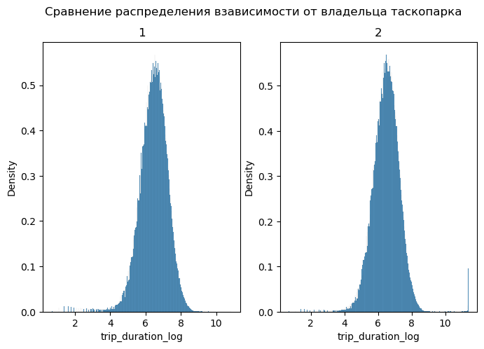

Распределения в группах практически не отличаются, есть незначительное отклонение у 2 таксопарка. Признак номер таксопарка не имеет значения при определении длительности поездки.

---

### Задание 3.3

**Цель задания:** Сравнить распределение длительности поездок в логарифмическом масштабе в зависимости от признака отправки сообщения поставщику.

**Решение:** 
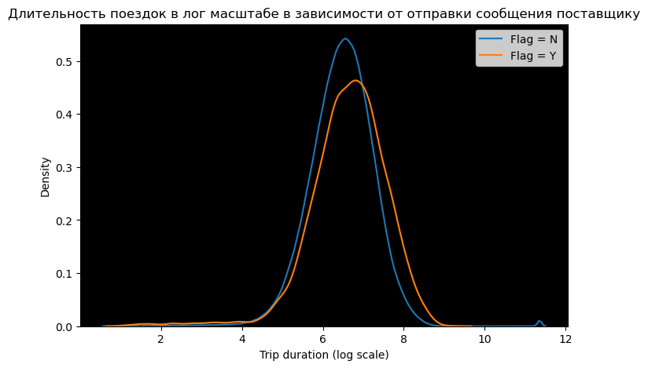

Распределения в группах значительно отличаются, признак отправки сообщения поставщику имеет значение при определении длительности поездки.


---

### Задание 3.4

**Цель задания:** Исследовать зависимость количества и длительности поездок от часа дня.

**Вопросы:** 
- а) В какое время суток такси заказывают реже всего?
- б) В какое время суток наблюдается пик медианной длительности поездок?

**Решение:**
- а) Реже всего такси заказывают с 0:00 до 5:00.

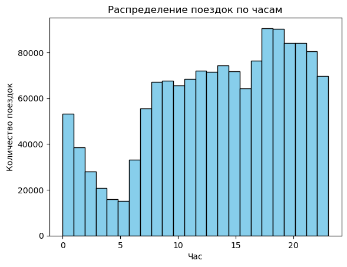

- б) Пик медианной длительности поездок наблюдается с 13:00 до 18:00.

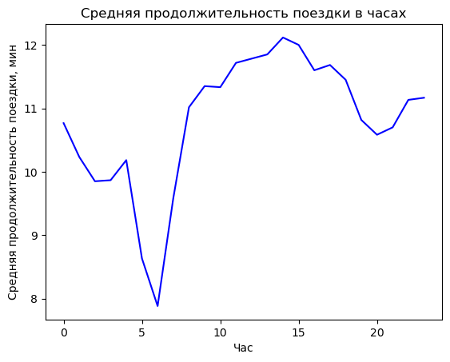

---

### Задание 3.5

**Цель задания:** Исследовать зависимость количества и длительности поездок от дня недели.

**Вопросы:** 
- а) В какой день недели совершается больше всего поездок?
- б) В какой день недели медианная длительность поездок наименьшая?

**Решение:**

- а) Больше всего поездок совершается в пятницу.


- б) Наименьшая медианная длительность поездок в воскресенье.

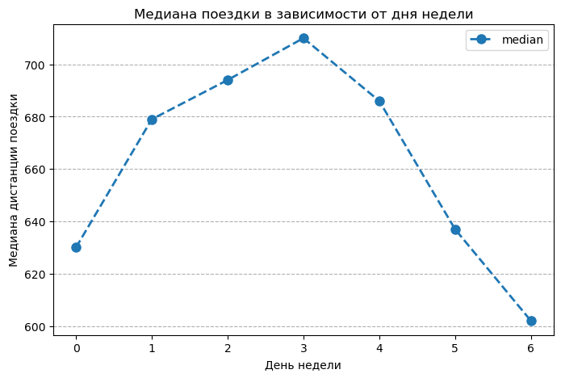
---

### Задание 3.6
**Постановка задания:** 
Построить сводную таблицу и тепловую карту, где по строкам отложены часы (`pickup_hour`), по столбцам - дни недели (`pickup_day_of_week`), а в ячейках - медианная длительность поездки (`trip_duration`).

**Решение:**
Создана сводная таблица и тепловая карта, представляющая собой медианную длительность поездок в зависимости от часов и дней недели. Самые продолжительные поездки наблюдаются с понедельника по пятницу в промежутке с 8 до 18 часов. Наибольшая медианная длительность поездки наблюдается в четверг в 14.00.

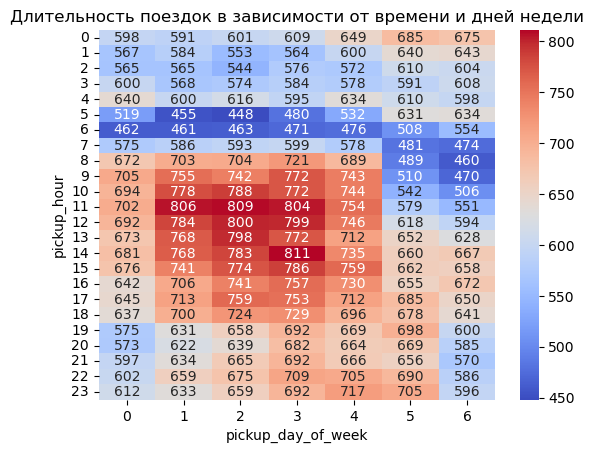

---

### Задание 3.7
**Постановка задания:** 
Построить две диаграммы рассеяния (scatter-диаграммы):
1. Иллюстрировать географическое расположение точек начала поездок (`pickup_longitude`, `pickup_latitude`)
2. Иллюстрировать географическое расположение точек завершения поездок (`dropoff_longitude`, `dropoff_latitude`)

Визуализация должна учитывать только те точки, которые находятся в пределах Нью-Йорка, с ограничениями: `city_long_border = (-74.03, -73.75)` и `city_lat_border = (40.63, 40.85)`. На диаграммы добавлена расцветка по десяти географическим кластерам (`geo_cluster`).

**Решение:**
Построены две диаграммы рассеяния, иллюстрирующие географическое расположение начала и окончания поездок с учетом ограничений по географии Нью-Йорка.

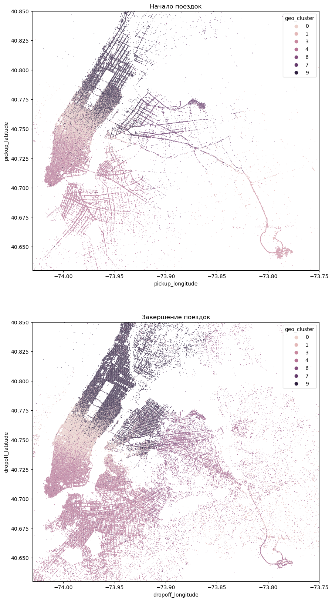


---

# 4. Отбор и преобразование признаков

### Задание 4.1
**Постановка задания:** 
1. Определить уникальный и неинформативный признак для каждой поездки.
2. Определить, какой признак в обучающем наборе данных создает утечку данных.
3. Исключить выбранные признаки из исходной таблицы с данными и подсчитать количество оставшихся столбцов.

**Решение:**
Признак `id` уникален для каждой поездки и не несет полезной информации для определения продолжительности поездки. Признак `dropoff_datetime` создает утечку данных, поскольку содержит информацию о целевой переменной. После исключения этих признаков остается 25 столбцов в таблице. 

---

### Задание 4.2
**Постановка задания:** 
1. Закодировать признак `vendor_id` в таблице `train_data` таким образом, чтобы он был равен 1, если идентификатор таксопарка равен 0, и 1 в противном случае.
2. Закодировать признак `store_and_fwd_flag` в таблице `train_data` таким образом, чтобы он был равен 0, если флаг выставлен в значение "N", и 0 в противном случае.
3. Рассчитать среднее по закодированным столбцам `vendor_id` и `store_and_fwd_flag`.

**Решение:**
Признаки `vendor_id` и `store_and_fwd_flag` были закодированы в соответствии с инструкциями. Среднее значение по столбцу `vendor_id` составляет 0.53, а по столбцу `store_and_fwd_flag` - 0.006.

---

### Задание 4.3
**Постановка задания:** 
1. Создать таблицу `data_onehot` из закодированных однократным кодированием признаков `pickup_day_of_week`, `geo_cluster` и `events` в таблице `train_data`.
2. Преобразовать полученный numpy-массив обратно в DataFrame, используя имена закодированных столбцов, полученных с помощью метода `get_feature_names_out()`.
3. Сформировать матрицу наблюдений `X`, вектор целевой переменной `y` и его логарифм `y_log`.
4. Разбить выборку на обучающую и валидационную в соотношении 67/33.
5. Оставить только те признаки, которые сильнее всего связаны с целевой переменной.

**Решение:**
Была создана таблица `data_onehot` с использованием OneHotEncoder для признаков `pickup_day_of_week`, `geo_cluster` и `events`, 
которая содержит 18 бинарных столбцов. Далее, была сформирована матрица наблюдений `X`, вектор целевой переменной `y` и 
его логарифм `y_log`. После разбиения выборки на обучающую и валидационную (в соотношении 67/33), оставлены только те признаки, которые сильнее 
всего связаны с целевой переменной.

---

### Задание 4.4
**Постановка задания:** 
С помощью `SelectKBest` отбрать 25 признаков, наилучшим образом подходящих для предсказания целевой переменной в логарифмическом масштабе. 

**Решение:**
Были отобраны следующие 25 признаки: `vendor_id`, `passenger_count`, `pickup_longitude`, `pickup_latitude`, `dropoff_longitude`, `dropoff_latitude`, `store_and_fwd_flag`, `pickup_hour`, `pickup_holiday`, `total_distance`, `total_travel_time`, `number_of_steps`, `haversine_distance`, `temperature`, `pickup_day_of_week_1`, `pickup_day_of_week_2`, `pickup_day_of_week_3`, `pickup_day_of_week_4`, `pickup_day_of_week_5`, `pickup_day_of_week_6`, `geo_cluster_1`, `geo_cluster_3`, `geo_cluster_5`, `geo_cluster_7`, `geo_cluster_9`.

---

### Задание 4.5
**Постановка задания:** 
Нормализовать предикторы в обучающей и валидационной выборках с помощью `MinMaxScaler`. Рассчитать среднее арифметическое для первого предиктора из валидационной выборки.

**Решение:**
Среднее арифметическое для первого предиктора валидационной выборки составляет 0.54.

---

## 5. Решение задачи регрессии: линейная регрессия и деревья решений

### Задание 5.1
**Постановка задания:** 
Построить модель линейной регрессии на обучающей выборке и рассчитать метрику RMSLE на тренировочной и валидационной выборках.

**Решение:**
Модель линейной регрессии была построена, и для неё были рассчитаны следующие метрики: 
- RMSLE на тренировочной выборке: 0.54
- RMSLE на валидационной выборке: 0.54

Схожесть метрик RMSLE на тренировочной и валидационной выборках указывает на отсутствие проблемы переобучения модели.

---

### Задание 5.2
**Постановка задания:** 
Сгенерировать полиномиальные признаки 2-ой степени и построить модель полиномиальной регрессии 2-ой степени на обучающей выборке. Рассчитать метрику RMSLE на тренировочной и валидационной выборках.

**Решение:**
Были сгенерированы полиномиальные признаки 2-ой степени, и модель полиномиальной регрессии была построена с такими характеристиками:
- RMSLE на тренировочной выборке: 0.47
- RMSLE на валидационной выборке: 0.7

Значительное различие между метриками RMSLE на тренировочной и валидационной выборках указывает на проблему переобучения модели.

---

### Задание 5.3
**Постановка задания:** 
Построить модель полиномиальной регрессии 2-ой степени с L2-регуляризацией на обучающей выборке и рассчитать метрику RMSLE на тренировочной и валидационной выборках.

**Решение:**
Модель полиномиальной регрессии 2-ой степени с L2-регуляризацией была построена с следующими результатами: 
- RMSLE на тренировочной выборке: 0.48
- RMSLE на валидационной выборке: 0.48  

Сопоставимость метрик RMSLE на тренировочной и валидационной выборках указывает на отсутствие проблемы переобучения модели.

---

### Задание 5.4
**Постановка задания:** 
Построить модель дерева решений на обучающей выборке и рассчитать метрику RMSLE на тренировочной и валидационной выборках.

**Решение:**
Была построена модель дерева решений с следующими результатами: 
- RMSLE на тренировочной выборке: 0.0
- RMSLE на валидационной выборке: 0.57

Разница между метриками RMSLE в выборках свидетельствует о переобучении модели.

---

### Задание 5.5
**Постановка задания:** 
Перебрать все возможные варианты глубины дерева решений в диапазоне от 7 до 20 и найти оптимальное значение максимальной глубины дерева.

**Решение:**

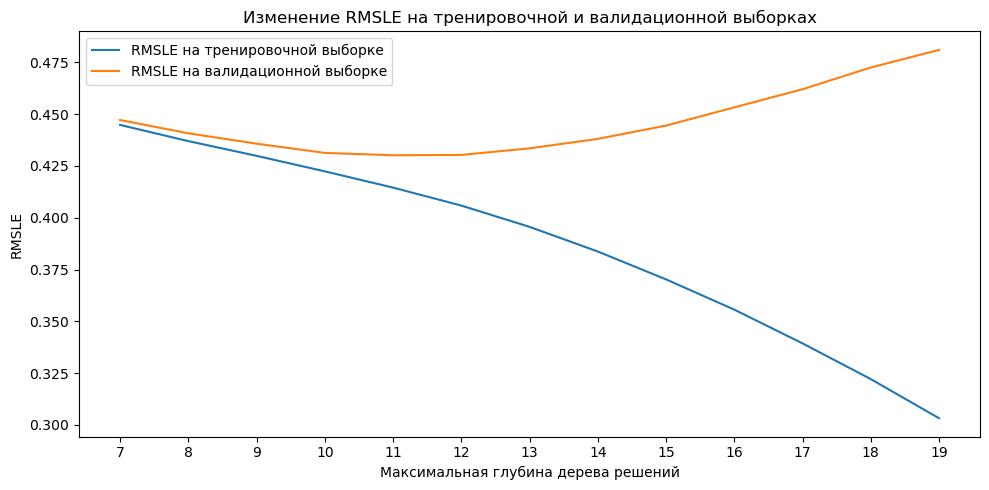

Оптимальная максимальная глубина дерева решений составила 11, при этом результаты были следующие: 
- RMSLE на тренировочной выборке: 0.41
- RMSLE на валидационной выборке: 0.43

Такие метрики RMSLE свидетельствуют об отсутствии переобучения, что является положительным результатом.

---

## 6. Решение задачи регрессии: ансамблевые методы и построение прогноза

### Задание 6.1
**Постановка задания:** 
Построить модель случайного леса на обучающей выборке и рассчитать метрику RMSLE на тренировочной и валидационной выборках.

**Решение:**
Была построена модель случайного леса с следующими результатами: 
RMSLE на тренировочной выборке: 0.4
RMSLE на валидационной выборке: 0.41

Переобучения модели не наблюдается.

---

### Задание 6.2
**Постановка задания:** 
Построить модель градиентного бустинга над деревьями решений на обучающей выборке и рассчитать метрику RMSLE на тренировочной и валидационной выборках.

**Решение:**
Была построена модель градиентного бустинга с следующими результатами: 
RMSLE на тренировочной выборке: 0.37
RMSLE на валидационной выборке: 0.39

Переобучения модели не наблюдается.

---

### Задание 6.3
**Постановка задания:** 
Определить, какая из построенных моделей показала наилучший результат.

**Решение:**
Сравнивая полученные модели, были получены следующие значения RMSLE на валидационной выборке:

- Линейная регрессия: 0.54
- Полиномиальная регрессия 2-й степени: 0.48
- Дерево решений: 0.43
- Случайный лес: 0.41
- Градиентный бустинг над деревьями решений: 0.39

Наименьшее значение RMSLE на валидационной выборке получилось у модели градиентного бустинга над деревьями решений, составив 0.39.

---

### Задание 6.4
**Постановка задания:** 
Построить столбчатую диаграмму коэффициентов значимости каждого из факторов и указать топ-3 наиболее значимых для предсказания целевого признака факторов.

**Решение:**
Важность признаков:
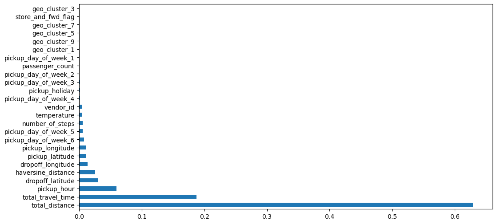

Топ-3 наиболее значимых факторов предсказания длительности поездки:
- total_distance
- total_travel_time
- pickup_hour

---

### Задание 6.5
**Постановка задания:** 
Для лучшей из построенных моделей рассчитать медианную абсолютную ошибку предсказания длительности поездки такси на валидационной выборке и перевести её в минуты.

**Решение:**
Была рассчитана медианная абсолютная ошибка для модели градиентного бустинга над деревьями решений. 
Ошибка составила 1.8 минуты.

---

В итоге был сделан submit предсказаний с помощью модели градиентого бустинга над деревьями решений для тестовых данных. 

### Бонусное задание
**Постановка задания:** 
Использовать модель экстремального градиентного бустинга (XGBoost) из библиотеки xgboost для предсказания длительности поездки такси, а также определить и визуализировать важность факторов с помощью функции `plot_importance()`.

**Решение:** 
Модель XGBoost была успешно обучена и применена для предсказания длительности поездки такси. 
RMSLE для этой модели составил 0.39119. 
Важность факторов была определена и визуализирована с помощью функции `plot_importance()`:

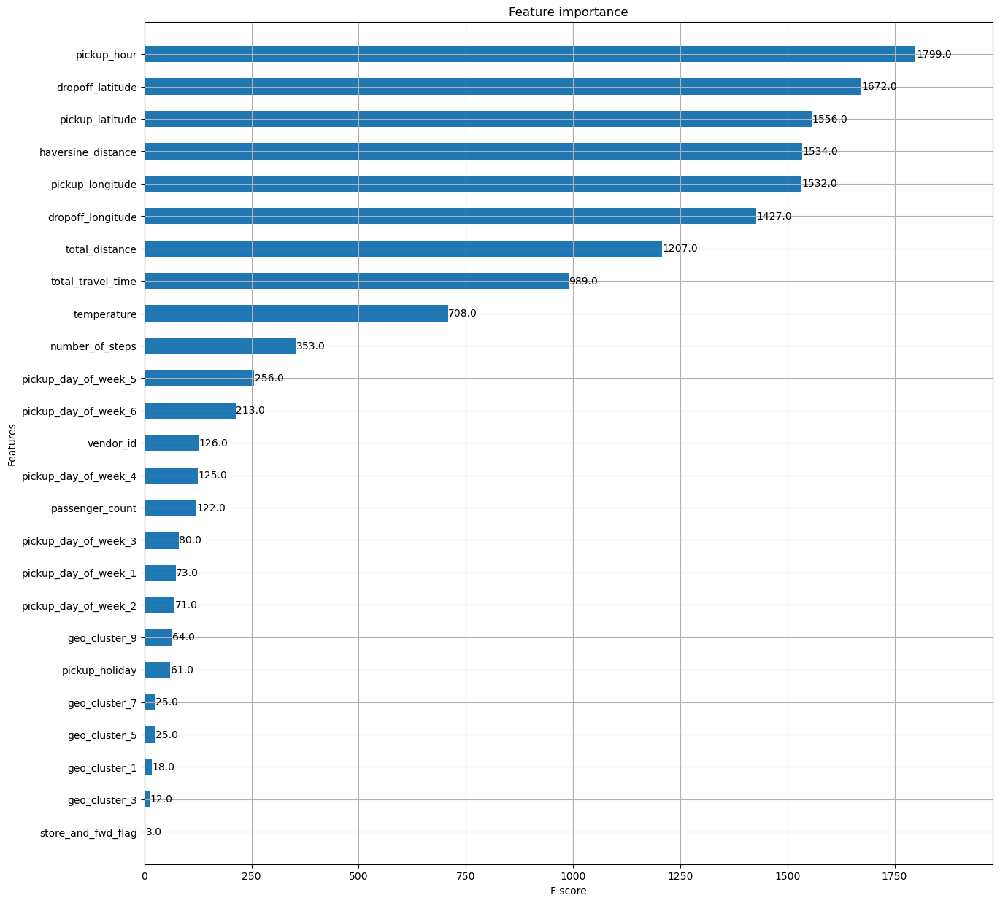